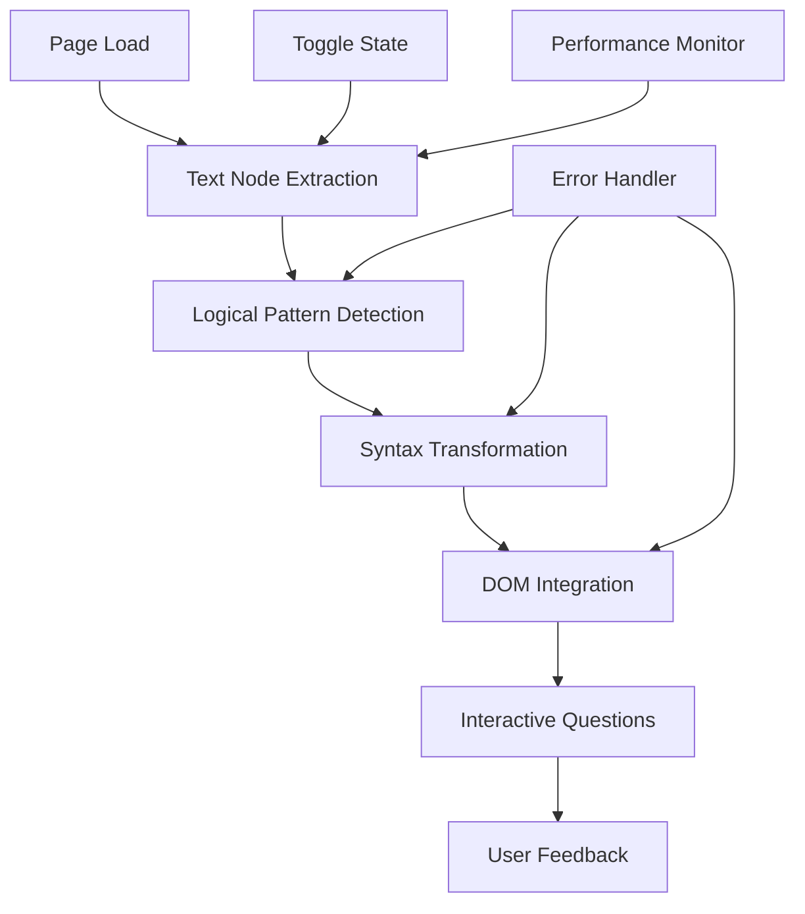

# Design Document: Syntactic Infiltration Chrome Extension

## Overview

Syntactic Infiltration is a Chrome extension that transforms logical sentences from webpages into Python-style pseudocode to provide passive programming exposure for beginner programmers. The extension operates as a content script that analyzes webpage text in real-time, identifies logical patterns, and seamlessly integrates Python-like code transformations into the existing DOM structure.

The system follows a pipeline architecture: text extraction → pattern detection → syntax transformation → DOM integration → user interaction. The extension prioritizes performance and user experience by limiting transformations, preserving webpage functionality, and providing optional interactive learning features.

## Architecture

### Extension Structure (Manifest V3)

The extension follows Chrome's Manifest V3 architecture with these core components:

- **Service Worker** (`background.js`): Manages extension lifecycle, toggle state persistence, and cross-tab communication
- **Content Script** (`content.js`): Injected into webpages to perform text analysis and DOM manipulation
- **Popup Interface** (`popup.html/js`): Provides user controls for toggling extension and viewing settings
- **Styles** (`content.css`): Defines visual styling for injected code blocks

### Processing Pipeline



### Data Flow

1. **Initialization**: Content script loads and checks extension toggle state
2. **Text Extraction**: TreeWalker API traverses DOM to collect text nodes
3. **Pattern Analysis**: Regular expressions and heuristics identify logical structures
4. **Transformation**: Matched patterns convert to Python pseudocode with proper formatting
5. **DOM Injection**: Code blocks insert adjacent to original text with preserved layout
6. **Monitoring**: MutationObserver watches for dynamic content changes

## Components and Interfaces

### TextExtractor Component

**Purpose**: Efficiently extract and filter text content from webpage DOM

**Interface**:
```javascript
class TextExtractor {
  extractTextNodes(rootElement): TextNode[]
  filterRelevantText(textNodes): TextNode[]
  isValidTextNode(node): boolean
}
```

**Implementation Details**:
- Uses TreeWalker API for efficient DOM traversal
- Filters out script tags, style elements, and hidden content
- Prioritizes paragraph text, list items, and article content
- Implements text length and quality heuristics

### PatternDetector Component

**Purpose**: Identify logical patterns suitable for Python transformation

**Interface**:
```javascript
class PatternDetector {
  detectLogicalPatterns(text): LogicalPattern[]
  classifyPattern(text): PatternType
  scorePattern(pattern): number
}
```

**Pattern Types**:
- **Conditional**: "If X then Y", "When X, Y happens"
- **Causal**: "Because X, Y occurs", "X causes Y"
- **Iterative**: "For each X", "While X continues"
- **Sequential**: "First X, then Y", "After X, do Y"

**Detection Strategy**:
- Regular expression matching for common logical structures
- Keyword-based classification (if, when, because, while, for, etc.)
- Sentence structure analysis using simple parsing rules
- Scoring system to prioritize clear, educational examples

### SyntaxTransformer Component

**Purpose**: Convert logical patterns into Python-style pseudocode

**Interface**:
```javascript
class SyntaxTransformer {
  transformToPython(pattern): PythonCode
  extractVariables(text): Variable[]
  formatCodeBlock(code): FormattedCode
}
```

**Transformation Rules**:
- Conditional statements → `if/elif/else` blocks
- Causal relationships → function definitions with clear parameters
- Iterative patterns → `for` or `while` loops
- Variables extracted from nouns/subjects → `snake_case` format
- Proper Python indentation and syntax highlighting

### DOMIntegrator Component

**Purpose**: Inject transformed code into webpage while preserving layout

**Interface**:
```javascript
class DOMIntegrator {
  injectCodeBlock(element, code): HTMLElement
  preserveLayout(originalElement): LayoutInfo
  applyCodeStyling(codeElement): void
}
```

**Integration Strategy**:
- Creates styled `<div>` containers for code blocks
- Positions code adjacent to or replacing original text
- Uses CSS isolation to prevent style conflicts
- Maintains responsive design compatibility
- Implements fade-in animations for smooth user experience

### InteractiveQuiz Component

**Purpose**: Provide occasional learning reinforcement through questions

**Interface**:
```javascript
class InteractiveQuiz {
  generateQuestion(transformation): Question
  displayQuestion(question): QuizElement
  evaluateAnswer(answer): boolean
}
```

**Question Types**:
- Variable identification: "What variable represents X?"
- Syntax completion: "Complete this if statement"
- Pattern recognition: "What type of logic does this represent?"
- Code prediction: "What would happen if condition Y is true?"

## Data Models

### LogicalPattern Model

```javascript
interface LogicalPattern {
  id: string
  originalText: string
  patternType: 'conditional' | 'causal' | 'iterative' | 'sequential'
  confidence: number
  variables: Variable[]
  transformationHint: string
}
```

### Variable Model

```javascript
interface Variable {
  originalWord: string
  snakeCaseName: string
  type: 'subject' | 'object' | 'action' | 'condition'
  context: string
}
```

### PythonCode Model

```javascript
interface PythonCode {
  code: string
  indentationLevel: number
  syntaxElements: SyntaxElement[]
  variables: Variable[]
  comments: string[]
}
```

### TransformationResult Model

```javascript
interface TransformationResult {
  originalElement: HTMLElement
  codeBlock: HTMLElement
  pattern: LogicalPattern
  pythonCode: PythonCode
  timestamp: Date
  userInteracted: boolean
}
```

### ExtensionState Model

```javascript
interface ExtensionState {
  isEnabled: boolean
  transformationCount: number
  currentPageTransformations: TransformationResult[]
  userPreferences: UserPreferences
  performanceMetrics: PerformanceData
}
```

### UserPreferences Model

```javascript
interface UserPreferences {
  maxTransformationsPerPage: number
  showInteractiveQuestions: boolean
  codeBlockStyle: 'minimal' | 'highlighted' | 'bordered'
  animationEnabled: boolean
}
```

## Correctness Properties

*A property is a characteristic or behavior that should hold true across all valid executions of a system—essentially, a formal statement about what the system should do. Properties serve as the bridge between human-readable specifications and machine-verifiable correctness guarantees.*

### Property 1: Comprehensive Text Analysis
*For any* webpage with text content, when the extension is active, all visible text nodes should be discovered, logical patterns should be correctly identified and classified, and only suitable patterns should be validated for transformation, with clear prioritization when multiple patterns exist.
**Validates: Requirements 1.1, 1.2, 1.3, 1.4**

### Property 2: Transformation Limit Enforcement  
*For any* webpage regardless of content volume, the extension should never create more than 5 code transformations per page.
**Validates: Requirements 1.5**

### Property 3: Python Syntax Correctness
*For any* logical pattern that gets transformed, the resulting pseudocode should use appropriate Python keywords, follow proper indentation rules, convert variables to snake_case format, and maintain syntactic correctness according to Python conventions.
**Validates: Requirements 2.1, 2.2, 2.3, 2.4, 8.1, 8.2, 8.3**

### Property 4: DOM Integration Safety
*For any* webpage where code blocks are injected, the original layout and functionality should be preserved, code blocks should have distinctive styling without CSS conflicts, and should be positioned correctly relative to source text.
**Validates: Requirements 3.1, 3.2, 3.3, 3.4, 3.5**

### Property 5: Toggle State Management
*For any* toggle state change, the extension should immediately reflect the new state in its behavior (stopping/starting processing), maintain state across browser sessions, and provide appropriate visual feedback.
**Validates: Requirements 4.2, 4.3, 4.4, 4.5**

### Property 6: Interactive Quiz Functionality
*For any* transformation when interactive features are enabled, quiz questions should be generated at appropriate intervals, test relevant Python concepts, provide immediate feedback, and maintain frequency limits to avoid disruption.
**Validates: Requirements 5.1, 5.2, 5.3, 5.4, 5.5**

### Property 7: Performance Constraints
*For any* webpage processing, text analysis should complete within 500ms, memory usage should stay under 50MB, the main browser thread should not be blocked, and resource usage should scale appropriately across multiple tabs.
**Validates: Requirements 6.1, 6.2, 6.4, 6.5**

### Property 8: Webpage Safety Preservation
*For any* webpage transformation, all original functionality (links, forms, interactive elements) should be preserved, critical elements should never be modified, errors should fail gracefully without breaking functionality, and sensitive pages should have appropriately limited transformations.
**Validates: Requirements 7.1, 7.2, 7.3, 7.5**

## Error Handling

### Text Processing Errors
- **Invalid DOM Structure**: Gracefully handle malformed HTML by skipping problematic nodes
- **Text Extraction Failures**: Continue processing with remaining text nodes if some fail
- **Pattern Detection Errors**: Log failed pattern matches and continue with successful ones
- **Encoding Issues**: Handle various text encodings and special characters safely

### Transformation Errors  
- **Syntax Generation Failures**: Fall back to simpler transformations or skip problematic patterns
- **Variable Extraction Errors**: Use generic variable names when extraction fails
- **Code Formatting Issues**: Apply basic formatting when advanced formatting fails

### DOM Integration Errors
- **CSS Conflicts**: Use CSS isolation techniques and fallback styling
- **Layout Disruption**: Detect layout issues and remove problematic injections
- **Element Access Errors**: Handle cases where target elements become unavailable

### Performance Degradation
- **Timeout Handling**: Cancel processing that exceeds time limits
- **Memory Pressure**: Reduce transformation count when memory usage is high  
- **CPU Throttling**: Implement processing delays when CPU usage is excessive

### User Interaction Errors
- **Quiz Generation Failures**: Skip interactive questions when generation fails
- **State Persistence Errors**: Use default settings when storage access fails
- **Toggle Communication Errors**: Ensure extension remains functional despite communication issues

## Testing Strategy

### Dual Testing Approach

The testing strategy employs both unit tests and property-based tests as complementary approaches:

- **Unit tests**: Verify specific examples, edge cases, and error conditions
- **Property tests**: Verify universal properties across all inputs  
- Together they provide comprehensive coverage where unit tests catch concrete bugs and property tests verify general correctness

### Property-Based Testing Configuration

- **Testing Library**: Use `fast-check` for JavaScript property-based testing
- **Test Iterations**: Minimum 100 iterations per property test due to randomization
- **Test Tagging**: Each property test must reference its design document property using the format: **Feature: syntactic-infiltration, Property {number}: {property_text}**

### Unit Testing Focus Areas

Unit tests should concentrate on:
- Specific examples demonstrating correct transformation behavior
- Edge cases like empty text, malformed HTML, and unusual logical patterns  
- Error conditions and recovery scenarios
- Integration points between components
- Browser-specific compatibility issues

### Property Testing Focus Areas

Property tests should verify:
- Text analysis works correctly across all webpage structures
- Transformations maintain correctness across all logical pattern types
- DOM integration preserves functionality across all website designs
- Performance constraints hold across all content volumes
- State management works consistently across all user interactions

### Test Environment Setup

- **Chrome Extension Testing**: Use Chrome's extension testing APIs and headless browser testing
- **DOM Simulation**: Create varied DOM structures for comprehensive testing
- **Performance Monitoring**: Include timing and memory usage measurements in tests
- **Cross-Browser Validation**: Test core functionality across different Chromium-based browsers